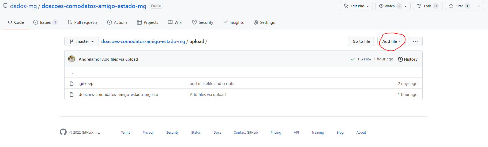
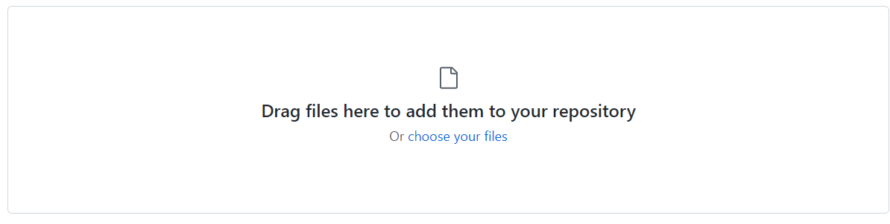
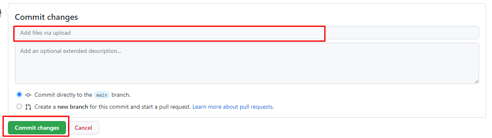
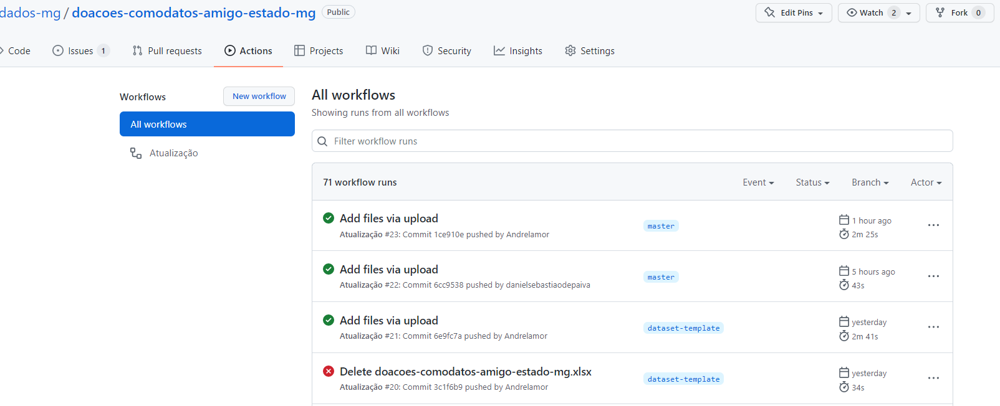
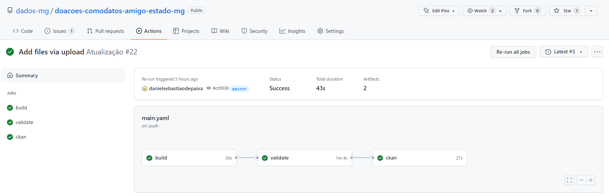
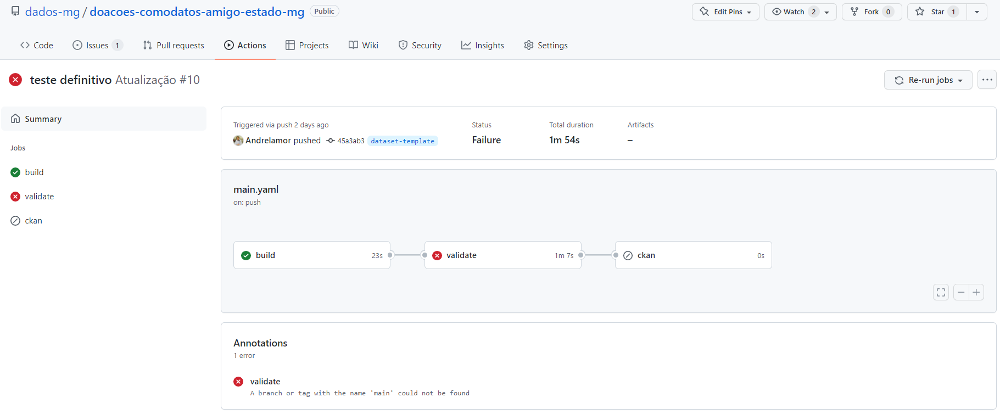
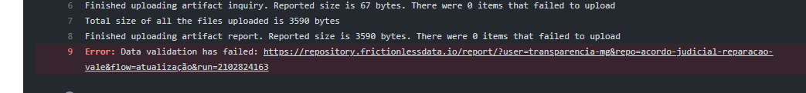

# Instruções para atualização, validação e publicação do conjunto de dados

## 1- Criação de usuário

Para o envio do conjunto de dados para o Portal de Dados Abertos do Estado de Minas Gerais - PDA/MG (https://dados.mg.gov.br/), será necessária a criação de uma conta no Github (ferramenta utilizada pela equipe da Diretoria Central de Transparência Ativa - DTA), para armazenamento dos conjuntos de dados, e uma conta no Portal de Dados Abertos.

#### Github

  - Acesse o Github através desse [link](https://github.com/signup?source=login) e siga os passos para a criação de uma conta.
  - O nome do usuário deverá conter apenas letras e não poderá conter caracteres especiais e números.
  - Após criação do usuário, informe à equipe da DTA os usuários criados, para que eles possam ser vinculados ao repositório do  conjunto de dados no Github.

#### Portal de Dados Abertos

Preencher e enviar para a DTA o formulário de criação de usuário disponível no SEI:

- Tipo de Processo: Governo Aberto, Transparência e Controle Social
- Tipo de Documento: CGE- Cadastro de Usuário no Portal de Dados Abertos
- Enviar o processo para a unidade CGE/DTA
- O documento deverá ser assinado pelo solicitante e pelo gestor imediato.

Após a criação dos usuários no Github no Portal de Dados Abertos, o próximo passo é vincular esses usuários no repositório do Github, para a atualização automática do Portal de Dados Abertos

#### Identificação do usuário para atualização

Essa etapa é realizada após a equipe da DTA vincular os usuários ao repositório. Para identificação do usuário responsável pela atualização dos dados no PDA/MG, será necessário realizar esse procedimento, uma única vez:

- No Portal de Dados Abertos, entre com o seu login e senha.
- Clique no nome do usuário e na tela seguinte, no canto esquerdo localize e copie a chave da API (essa chave é individual para cada usuário).
- No repositório do GitHub, clique em *Settings* (menu superior direito) e, em seguida, clique em *Secrets* e em *Actions* (menu esquerdo).
- Clique em  *New repository secrets* e insira o nome do usuário no campos *Name* **CKAN_KEY_NOMEUSUARIO** (alterando o "nomeusuario" para o nome cadastrado no Portal Dados Abertos)
- Insira a chave da API no campo *Value* e clique em *Add secret*.

## 2- Atualização e validação no GitHub

#### 2.1 Atualização

Sempre que os dados forem alterados, as novas informações devem ser atualizadas no repositório do GitHub.

**Premissas:**

- Cada evento deve ser salvo em uma nova linha na planilha excel;
- A estrutura do arquivo não pode ser alterada (quantidade e ordem das colunas, características dos valores de cada uma delas);
- O arquivo atualizado deve ser o mesmo nome do já existente na pasta **/upload/** 
- O arquivo deve ser salvo no formato .xlxs

#### 2.2 Upload

Após a atualização dos dados, acesse a sua conta do [Github](https://github.com/login) e em seguida acesse o repositório do conjunto de dados.

- Na pasta **/upload/** clique em *Add file* (Adicionar arquivo) e em seguida clique em *upload files* (upload de arquivos*);

- Arraste o arquivo ou clique em *choose your files* para selecionar o arquivo no computador local.

- Após o arquivo ser carregado, digite na área *Commit changes* uma mensagem curta e significativa que descreva a alteração feita no arquivo e clique no botão verde *Commit changes*                    
 ***Exemplo***: *Insere doação publicada dia dd-mm-aaaa.*

## 3. Validação

Após realizar o *commit* do arquivo, é necessário verificar se o mesmo foi validado. Ou seja, se o arquivo está de acordo com os metadados descritos no `datapackage.json`.

- Na página inicila do Repositório, clique em *Actions* (terceira opção do menu supoerior). O campo *All workflows* irá apresentar todos os *commits* realizados no repositório.

- Clique no *commit* desejado e verifique o fluxo de validação.

- Se o processo for exibido como concluído em todas as etapas, apenas verifique no Portal de Dados Abertos se os dados alterados realmente foram carregados.

- Se aparecer algum problema durante a validação, siga os passos abaixo:

  - Clique em *validate* e no link que apresenta o erro de validação;

  - Em seguida verifique qual o erro apresentado e faça as correções necessárias.

---

- Uma lista contendo erros comuns de validação pode ser consultada [aqui](https://github.com/dados-mg/dados-mg.github.io/blob/erros-valiacao/erros-validacao/erros-comuns-validacao.md)

* Faça novamente o *upload* do arquivo corrigido e repita os passos executados anteriormente.

